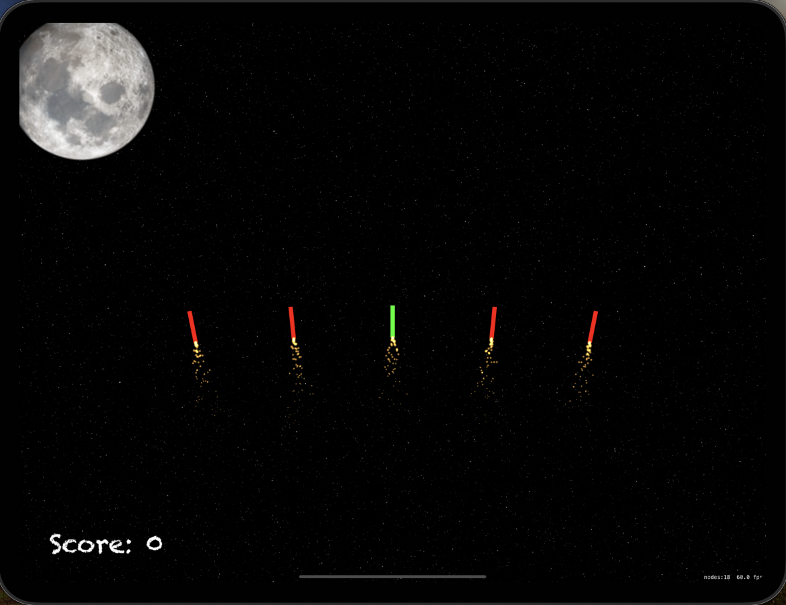
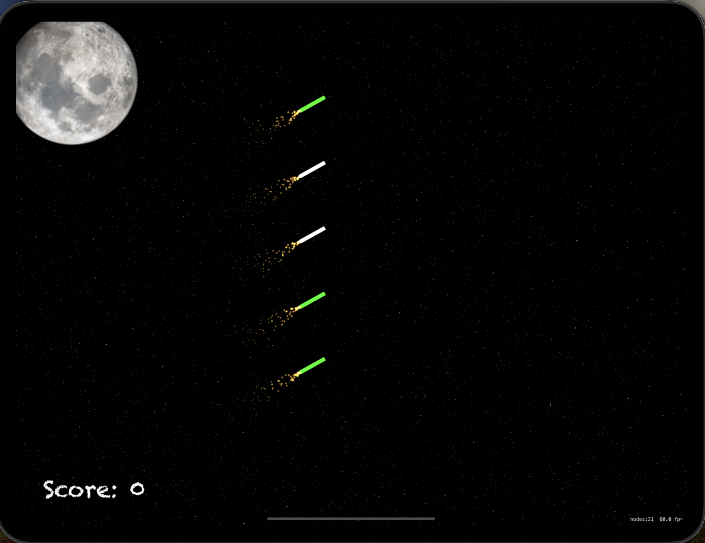

# Project20 Fireworks Game

This is a SpriteKit-based game where the player can create and interact with firework explosions. The goal of the game is to score points by selecting and exploding firework explosions.

## Features

* Create and interact with firework explosions
* Select and explode firework to score points
* Firework explosions have different colors and types
* Game keeps track of player's score

## Screenshots

  

  

## Game Rules

* The player touches the screen to select same color firework
* Then player can interact by shaking the device to explode them
* Good firework award points when exploded
* Game over screen appears after a delay

## Technical Requirements

* iOS 12.0+
* Xcode 12.0+
* Swift 5.0+

## Controls

* Touch the screen to select same color firework
* Shake the device to trigger the fireworks explosions

## Technical Requirements

* iOS 12.0+
* Xcode 12.0+
* Swift 5.0+

## Possible Development

* Add sound effects for firework explosion creation and destruction
* Add more types of firework explosions (e.g. special power-up explosions)
* Implement restart functionality
